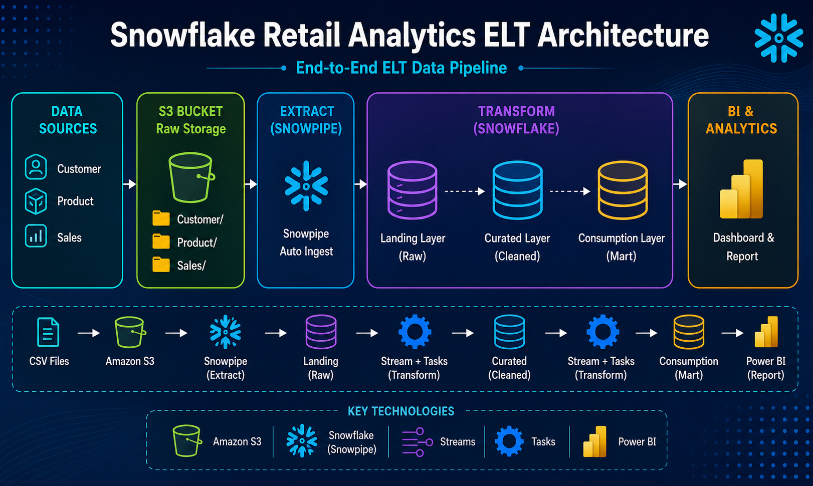

# End-to-End Snowflake ELT Data Engineering Pipeline

### Project Overview

This project demonstrates the design and implementation of a modern cloud-native ELT (Extract, Load, Transform) pipeline using Snowflake, Amazon S3, and Power BI.

The pipeline automatically ingests retail data from Amazon S3 into Snowflake using Snowpipe, performs incremental transformations with Streams and Tasks, and delivers analytics-ready data through a dimensional model for business intelligence reporting.

The solution follows industry best practices by separating the data warehouse into Landing, Curated, and Consumption layers, ensuring scalability, maintainability, and efficient incremental processing.

### Architecture

### Technology Stack
- Snowflake
- Amazon S3
- Snowpipe
- Snowflake Streams
- Snowflake Tasks
- SQL
- Power BI
- Star Schema Data Modeling
