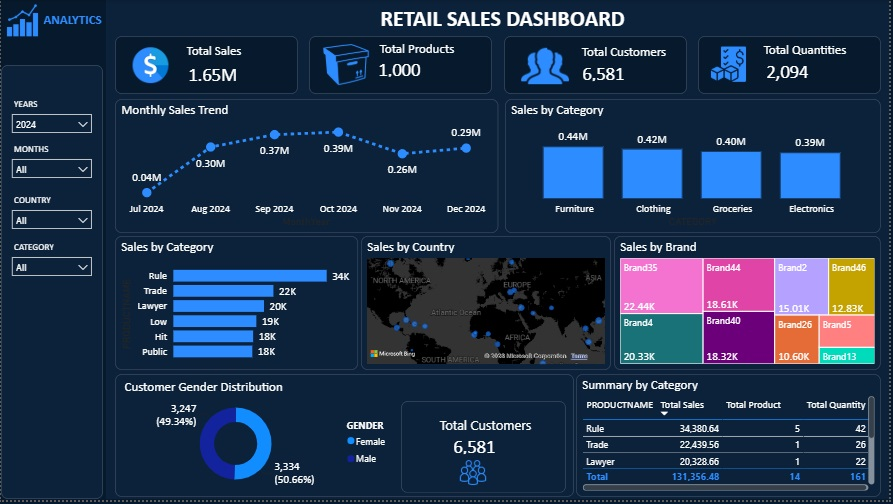

# End-to-End Snowflake ELT Data Engineering Pipeline

### Project Overview

This project demonstrates the design and implementation of a modern cloud-native ELT (Extract, Load, Transform) pipeline using Snowflake, Amazon S3, and Power BI.

The pipeline automatically ingests retail data from Amazon S3 into Snowflake using Snowpipe, performs incremental transformations with Streams and Tasks, and delivers analytics-ready data through a dimensional model for business intelligence reporting.

The solution follows industry best practices by separating the data warehouse into Landing, Curated, and Consumption layers, ensuring scalability, maintainability, and efficient incremental processing.

### Architecture

### Technology Stack
- Snowflake
- Amazon S3
- Snowpipe
- Snowflake Streams
- Snowflake Tasks
- SQL
- Power BI
- Star Schema Data Modeling

### Data Model
#### Landing Layer (Raw)
Transient tables used to receive data exactly as delivered from Amazon S3.
- CUSTOMER_RAW
- PRODUCT_RAW
- SALES_RAW

#### Curated Layer
Transient tables containing validated, standardized, and deduplicated data.
- CUSTOMER_CURATED
- PRODUCT_CURATED
- SALES_CURATED

### Transformations include:
- Removing duplicate records
- Standardizing text values
- Data quality validation

### Consumption Layer
Permanent reporting tables designed using a star schema.

#### Dimensions
- DIM_CUSTOMER
- DIM_PRODUCT

#### Fact
- FACT_SALES
This layer is optimized for analytics and Power BI reporting.

### Pipeline Workflow
1. Retail CSV files are uploaded into Amazon S3.
2. Snowpipe automatically detects and loads new files into the Landing layer.
3. Streams capture incremental changes.
4. Tasks execute automated MERGE statements to populate the Curated layer.
5. Additional Streams and Tasks synchronize the Consumption layer.
6. Power BI connects directly to Snowflake for interactive reporting.
No manual intervention is required after new files are uploaded.

###  Snowflake Features Demonstrated
- Snowpipe Auto-Ingest
- Storage Integration
- External Stages
- Streams
- Tasks
- MERGE
- Transient Tables
- Permanent Tables
- Incremental Data Loading
- Automated ELT Pipeline

### Power BI Dashboard

### Project Highlights
- Built an end-to-end cloud-native ELT pipeline
- Automated data ingestion using Snowpipe
- Implemented incremental loading with Streams and Tasks
- Designed a scalable three-layer Snowflake architecture
- Developed a star schema for business reporting
- Connected Snowflake directly to Power BI
- Applied data warehousing and dimensional modeling best practices

### Conclusion
This project demonstrates how Snowflake can be used to build a scalable, automated ELT pipeline using native platform capabilities such as Snowpipe, Streams, and Tasks. The final dimensional model supports fast, reliable analytics in Power BI while following modern cloud data engineering best practices.
If you find this project useful, feel free to ⭐ the repository or connect with me on LinkedIn to discuss Snowflake, data engineering, and cloud analytics.

